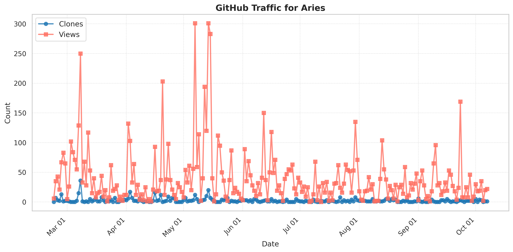

# Team

Principal Investigators: Prof. Peipei Zhou (Brown University), https://peipeizhou-eecs.github.io/, Prof. Zhiru Zhang (Cornell University), https://zhang.ece.cornell.edu/

Ph.D. Students: Jinming Zhuang (Student Lead), Shaojie Xiang (Student Lead), Hongzheng Chen, Niansong Zhang, Zhuoping Yang, Tony Mao

# ARIES: An Agile MLIR-Based Compilation Flow for Reconfigurable Devices with AI Engines (FPGA'25)

## Installation Guide

### Prerequisites
```
python 3.12.x
AMD Vitis 2023.2
clang
lld
ninja
```
### 0. Install prerequisites on Ubuntu 20.04 (Since "sudo" is required, it is highly recommended to use a clean and isolated environment)
```sh
sudo apt-get update
sudo apt-get upgrade
sudo apt-get install gcc-multilib
sudo apt install graphviz
sudo apt install clang lld ninja-build
sudo apt-get install libssl-dev libidn11
```

#### Install Python3.12 (See here if python3.12 is not found: [Python3.12 Setup](utils/README.md#-python312-setup))
```sh
sudo apt-get install python3.12-dev
sudo apt install python3.12-venv
```

### 1. Download Aries & Submodules
```sh
git clone --recursive https://github.com/arc-research-lab/Aries.git
cd Aries
```

### 2. Setup Python Virtual Environment
```sh
source utils/setup_python_packages.sh
```

### 3. Build LLVM & MLIR Projects
```sh
source utils/build-llvm.sh
```

### 4. Build MLIR-AIE Project 
#### AIE License is required: 
#### (1) please view the steps here: https://riallto.ai/prerequisites-aie-license.html <br> (2) Additionally, hostname can be found by running:<br>
```
hostname
```
#### (3) After "Xilinx.lic" is generated, save it to the correct PATH (~/.Xilinx).


#### Need to specify using local cmake instead of Vitis cmake inside "utils/build-mlir-aie.sh" (In this script, it is set to the default PATH which should work if following the CMAKE installation before)
```sh
source /tools/Xilinx/Vitis/2023.2/settings64.sh
source utils/build-mlir-aie.sh
```

### 5. Build Aries Project
```sh
source utils/build-aries.sh
export PATH=$PATH:$PWD/build/bin
source aries/bin/activate
```

## Run ARIES on VCK190
### Follow the on-board execution flow in "example_new"
```sh
cd example_new
```

## Publications
For more details, please refer to our [FPGA'25 paper (Best paper nominee)](https://dl.acm.org/doi/10.1145/3706628.3708870). Please use the following bibtex to cite ARIES:
```bibtex
@inproceedings{aries2025fpga,
author = {Zhuang, Jinming and Xiang, Shaojie and Chen, Hongzheng and Zhang, Niansong and Yang, Zhuoping and Mao, Tony and Zhang, Zhiru and Zhou, Peipei},
title = {ARIES: An Agile MLIR-Based Compilation Flow for Reconfigurable Devices with AI Engines},
year = {2025},
isbn = {9798400713965},
publisher = {Association for Computing Machinery},
address = {New York, NY, USA},
url = {https://doi.org/10.1145/3706628.3708870},
doi = {10.1145/3706628.3708870},
booktitle = {Proceedings of the 2025 ACM/SIGDA International Symposium on Field Programmable Gate Arrays},
pages = {92–102},
numpages = {11},
keywords = {aie architecture, compiler, hardware accelerator, mlir},
location = {Monterey, CA, USA},
series = {FPGA '25}
}
```

## 🚀 Thank You for Using ARIES! ! !
### Your support and growing engagement inspire us to continually improve and enhance ARIES project.
+ Total Views since 02/22/2025: <!--VIEWS-->10360<!--/VIEWS-->
+ Total Downloads since 02/22/2025: <!--CLONES-->769<!--/CLONES-->

